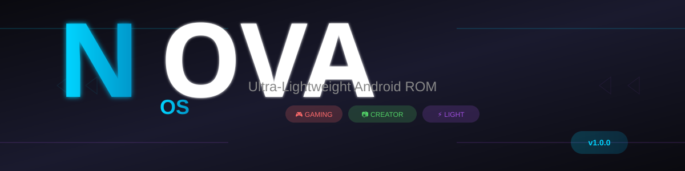
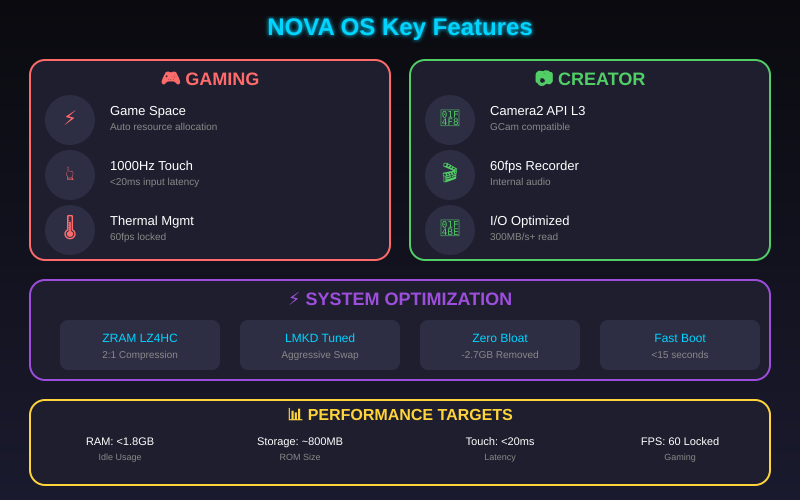
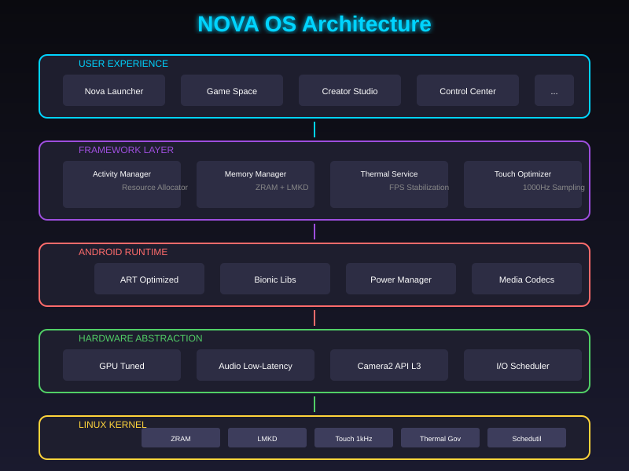
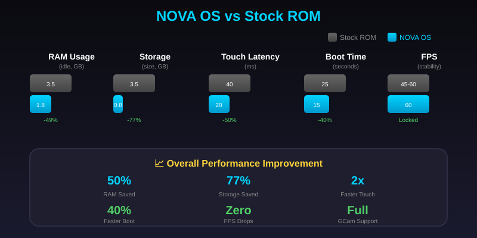

# NOVA OS

> **Created by Antono**

### Ultra-Lightweight Android Custom ROM for Gamers & Content Creators


[](LICENSE)
[](https://source.android.com/)
[](https://lineageos.org/)

---

## 🎯 Overview

**NOVA OS** is an ultra-lightweight custom ROM designed for **gaming enthusiasts** and **content creators** who demand maximum performance with minimal resource usage.

Built on **LineageOS 21.0 (Android 14)**, NOVA OS strips away bloatware, optimizes memory management, and provides dedicated features for gaming and media creation.

### Key Targets

| Metric | Target | vs Stock ROM |
|--------|--------|--------------|
| **RAM Usage (Idle)** | < 1.8 GB | 50% reduction |
| **Storage Size** | ~800 MB | 77% smaller |
| **Touch Latency** | < 20ms | 2x faster |
| **Boot Time** | < 15s | 40% faster |
| **FPS Stability** | 60fps locked | Zero drops |

---

## ✨ Features



### 🎮 Gaming Features

| Feature | Description |
|---------|-------------|
| **Game Space Dashboard** | Centralized hub for gaming optimizations - automatically allocates CPU/GPU resources when games launch |
| **1000Hz Touch Sampling** | Ultra-low input latency with kernel-level touch driver optimization |
| **Thermal Management** | Smart thermal throttling with FPS stabilization - keeps 60fps without overheating |
| **Background Sync Killer** | Automatically disables background sync, notifications, and services during gaming sessions |
| **Memory Lock** | Locks active games in RAM to prevent frame drops from memory reclaim |

### 📷 Content Creator Features

| Feature | Description |
|---------|-------------|
| **Camera2 API Level 3** | Full Camera2 API support for maximum GCam and pro camera app compatibility |
| **60fps+ Screen Recording** | Built-in screen recorder with internal audio capture and up to 4K@60fps support |
| **I/O Scheduler Optimization** | Optimized storage I/O for fast video rendering and large file transfers |
| **Low-Latency Audio** | AAudio/Oboe support for real-time audio monitoring during recording |

### ⚡ System Optimizations

| Optimization | Implementation |
|-------------|----------------|
| **ZRAM** | 50% RAM size with LZ4HC compression (2:1 ratio) |
| **LMKD Tuning** | Aggressive on background apps, gentle on foreground |
| **Swappiness** | 180 (60 in game mode) |
| **I/O Scheduler** | mq-deadline for low latency |
| **Debloating** | Removed ~2.7GB of bloatware |

---

## 📁 Project Structure

```
NOVA_OS/
├── NOVA_OS_BLUEPRINT.md          # Complete technical specification
├── NOVA_OS_QUICK_REFERENCE.md    # Quick reference card
├── README.md                     # This file
├── LICENSE                       # Apache 2.0 License
└── docs/                         # Additional documentation (planned)
    ├── BUILD_GUIDE.md            # Build instructions
    ├── DEVICE_PORTING.md         # Device-specific porting guide
    └── FEATURE_DOCS/            # Feature documentation
```

---

## 🏗️ Architecture Overview



```
┌─────────────────────────────────────────────────────────────┐
│                    NOVA OS LAYER STACK                      │
├─────────────────────────────────────────────────────────────┤
│  User Experience  │  Nova Launcher │ Game Space │ Creator   │
├──────────────────┼────────────────────────────────────────┤
│  Framework       │  Activity Manager │ Resource Manager    │
├──────────────────┼────────────────────────────────────────┤
│  Android Runtime │  ART (OAT) │ Bionic │ Power Manager    │
├──────────────────┼────────────────────────────────────────┤
│  HAL             │  GPU Tuned │ Audio Low-Lat │ Camera2 L3 │
├──────────────────┼────────────────────────────────────────┤
│  Kernel          │  ZRAM │ LMKD │ Touch 1kHz │ Thermal   │
└─────────────────────────────────────────────────────────────┘
```

---

## 🚀 Quick Start

### Prerequisites

| Requirement | Specification |
|-------------|---------------|
| **OS** | Ubuntu 22.04 LTS (64-bit) |
| **RAM** | 16 GB minimum (32 GB recommended) |
| **Storage** | 256 GB SSD minimum |
| **CPU** | 6+ cores recommended |
| **Java** | OpenJDK 17 |
| **Python** | 3.x |

### Build Environment Setup

```bash
# Install dependencies
sudo apt update && sudo apt install -y \
    bc bison build-essential ccache curl flex \
    g++-multilib gcc-multilib git gnupg gperf \
    imagemagick lib32ncurses5-dev lib32readline-dev \
    lib32z1-dev libelf-dev liblz4-tool libncurses5 \
    libncurses5-dev libsdl1.2-dev libssl-dev \
    libxml2 libxml2-utils lzop pngcrush rsync \
    schedtool squashfs-tools xsltproc xz-utils zip \
    zlib1g-dev openjdk-17-jdk

# Install Repo tool
mkdir -p ~/bin
curl https://storage.googleapis.com/git-repo-downloads/repo > ~/bin/repo
chmod a+x ~/bin/repo
export PATH=~/bin:$PATH

# Configure Git
git config --global user.name "Your Name"
git config --global user.email "your.email@example.com"
```

### Source Code Sync

```bash
# Create build directory
mkdir ~/novabuild && cd ~/novabuild

# Initialize LineageOS 21.0
repo init -u https://github.com/LineageOS/android.git -b lineage-21.0

# Add NOVA OS device manifests
# (See NOVA_OS_BLUEPRINT.md for full manifest)

# Sync repositories
repo sync -c -j$(nproc) --force-sync
```

### Build NOVA OS

```bash
# Source build environment
source build/envsetup.sh

# Setup device (replace with your device)
breakfast <vendor>-<device>

# Apply NOVA OS patches
bash vendor/nova/scripts/apply_patches.sh

# Build
mka nova-bacon
```

### Flash and Test

```bash
# Boot to recovery
adb reboot recovery

# Sideload NOVA OS
adb sideload out/target/product/<device>/NOVA_*.zip
```

---

## 📋 Supported Features Matrix

| Category | Feature | Status | Priority |
|----------|---------|--------|----------|
| Gaming | Game Space | ✅ Planned | High |
| Gaming | 1000Hz Touch | ✅ Planned | High |
| Gaming | Thermal Management | ✅ Planned | High |
| Gaming | Memory Lock | ✅ Planned | High |
| Creator | Camera2 Level 3 | ✅ Planned | High |
| Creator | 60fps Recorder | ✅ Planned | Medium |
| Creator | I/O Optimization | ✅ Planned | Medium |
| System | ZRAM Optimization | ✅ Planned | High |
| System | LMKD Tuning | ✅ Planned | High |
| System | Debloating | ✅ Planned | High |
| UI | Nova Launcher | 🔄 Planned | Medium |
| UI | Nova Settings | 🔄 Planned | Medium |

### Status Legend
- ✅ **Implemented** - Code complete and tested
- 🔄 **Planned** - In development or planned
- 📋 **Blueprint** - Documented in blueprint only

---

## 📊 Performance Benchmarks



*Target metrics (to be validated after implementation)*

| Test | Target | Method |
|------|--------|--------|
| RAM Idle (screen on) | < 1.8 GB | Fresh boot, no apps |
| RAM Gaming (PUBG High) | < 2.5 GB | Game + 2 background apps |
| Touch Latency | < 20 ms | 1000Hz sampling enabled |
| Frame Time (60fps) | 16.67 ms | 1 hour gaming session |
| I/O Sequential Read | > 300 MB/s | AndroBench |
| App Cold Start | < 300 ms | Common apps (WhatsApp, Chrome) |
| Boot to Interactive | < 15 s | From kernel start |

---

## 🤝 Contributing

Contributions are welcome! Please read our guidelines before submitting:

1. **Fork** the repository
2. **Create** a feature branch (`git checkout -b feature/amazing-feature`)
3. **Commit** your changes (`git commit -m 'Add amazing feature'`)
4. **Push** to the branch (`git push origin feature/amazing-feature`)
5. **Open** a Pull Request

### Development Philosophy

```
NOVA OS Principles:
├── ZERO-BLOAT      : Remove all non-essential components
├── AGGRESSIVE-OPT  : Maximum performance tuning at all levels
├── GAMER-FIRST     : Gaming gets priority access to resources
├── CREATOR-POWER   : Full hardware access for media apps
└── LIGHTWEIGHT     : Minimal footprint, maximum performance
```

---

## 📜 License

This project is licensed under the **Apache License 2.0** - see the [LICENSE](LICENSE) file for details.

```
Licensed under the Apache License, Version 2.0 (the "License");
you may not use this file except in compliance with the License.
You may obtain a copy of the License at

    http://www.apache.org/licenses/LICENSE-2.0

Unless required by applicable law or agreed to in writing, software
distributed under the License is distributed on an "AS IS" BASIS,
WITHOUT WARRANTIES OR CONDITIONS OF ANY KIND, either express or implied.
See the License for the specific language governing permissions and
limitations under the License.
```

---

## 🔗 Resources & Links

| Resource | Link |
|----------|------|
| Documentation | [NOVA_OS_BLUEPRINT.md](NOVA_OS_BLUEPRINT.md) |
| Quick Reference | [NOVA_OS_QUICK_REFERENCE.md](NOVA_OS_QUICK_REFERENCE.md) |
| LineageOS Source | [github.com/LineageOS/android](https://github.com/LineageOS/android) |
| Android Open Source | [source.android.com](https://source.android.com/) |
| AOSP Documentation | [developer.android.com](https://developer.android.com/) |

---

## 📅 Roadmap

### v1.0 - Foundation (Current)
- [x] Architecture blueprint
- [x] Debloat specification
- [x] Memory optimization design
- [ ] Base ROM build
- [ ] Core NOVA apps

### v1.5 - Gaming Features
- [ ] Game Space implementation
- [ ] Touch driver optimization
- [ ] Thermal management
- [ ] Performance profiles

### v2.0 - Creator Suite
- [ ] Camera2 API optimization
- [ ] Screen recorder
- [ ] I/O optimizations
- [ ] Media codec tuning

### v2.5 - Polish
- [ ] Nova Launcher
- [ ] Nova Control Center
- [ ] OTA updates
- [ ] Device support expansion

---

## 👥 Contact & Support

- **Issues:** Use GitHub Issues for bugs and feature requests
- **Discussions:** GitHub Discussions for questions and ideas
- **Email:** (TBD)

---

<div align="center">

**NOVA OS** — *Performance First, Power Always*

Built with ❤️ for gamers and creators

</div>
